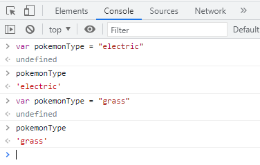
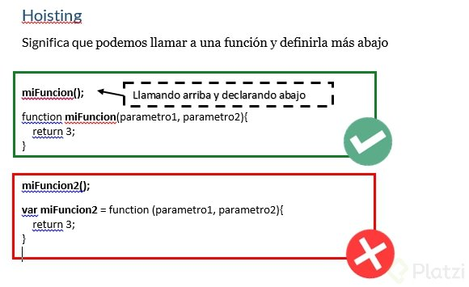
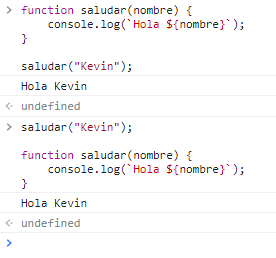
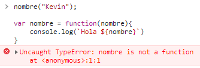

<!-- IMAGEN DE INICIO -->
<a name="inicio"></a>


<!-- CONTENIDO CURSO -->


# CONTENIDO DEL CURSO
## [Modulo 1 Introducción a JavaScript](#modulo1)

* [**Clase 1**](#clase1)   ¿Qué es JavaScript?
* [**Clase 2**](#clase2) ¿Por qué JavaScript?
* [**Clase 3**](#clase3) Elementos de un Lenguaje de Programación: Variables, Funciones y Sintaxis
* [**Clase 4**](#clase4) Variables en JavaScript 
* [**Clase 5**](#clase5) Funciones en JavaScript
* [**Clase 6**](#clase6) ¿Qué es una función declarativa y una expresiva?  
  

## Modulo 2 Bases de JavaScript

* [**Clase 7**](#clase7) Scope
* [**Clase 8**](#clase8) Hoisting
* [**Clase 9**](#clase9) Coerción
* [**Clase 10**](#clase10) Valores: Truthy y Falsy
* [**Clase 11**](#clase11) Operadores: Asignación, Comparación y Aritméticos.

## Modulo 3 Condicionales

* [**Clase 12**](#clase12) Condicionales: If, Else, else if
* [**Clase 13**](#clase13) Switch
  

## Modulo 4 Arrays

* [**Clase 14**](#clase14) Arrays

  
## Modulo 6 Loops
 
* [**Clase 15**](#clase15) Loops: For y For...of
* [**Clase 16**](#clase16) Loops: While


## Modulo 7 Objects

 
* [**Clase 17**](#clase17) Objects
* [**Clase 18**](#clase18) Objects: Función constructora

 
## Modulo 8 Métodos de Arrays

* [**Clase 19**](#clase19) Métodos de recorridos de Arrays
* [**Clase 20**](#clase20) Recorriendo Arrays con .find(), .forEach() y .some()
* [**Clase 21**](#clase21) Eliminando elementos de un Array 


## Modulo 9 Próximos pasos con JavaScript
 
* [**Clase 22**](#clase22) Continúa con el Curso Práctico de JavaScript

<a name="modulo1"></a>

# **<span style="color:red"> Modulo 1 Introducción a JavaScript </span>** 

[**Volver al inicio**](#inicio)
<a name="clase1"></a>
## **<span style="color:yellow"> **Clase 1** ¿Qué es JavaScript? </span>** 

### **¿Cómo nace JavaScript?**

Nace con la necesidad de generar dinamismo en las páginas web y que a su vez los usuarios y las empresas pudieran interactuar unos con otros.

### **¿Qué es JavaScript?**

Es un lenguaje **<span style="color:red"> interpretado </span>**, orientado a objetos, débilmente tipado y dinámico.

**Débilmente tipado** 
Se pueden hacer operaciones entre tipos distintos de datos (enteros con strings, booleanos con enteros, etc.).

``` javascript
4 + "7"; // 47
4 * "7"; // 28
2 + true; // 3
false - 3; // -3
```
**Dinámico**
Corre directamente en la etapa de Runetime sin una etapa de compilación previa. Esto permite probar nuestro código inmediatamente; pero también es lo que hace que los errores se muestren hasta que se ejecuta el programa.

### **¿Realmente es JavaScript un lenguaje interpretado?**

Si, y la razón es que el navegador lee linea por linea nuestro código el cuál le indica lo que tiene que hacer, sin la necesidad de compilar. Todo esto es controlado por el motor de Javascript V8 del navegador

[**Volver al inicio**](#inicio)
<a name="clase2"></a>
## **<span style="color:yellow"> **Clase 2** ¿Por qué JavaScript? </span>** 

JavaScript tiene una comunidad enorme de desarrolladores que te pueden ir ayudando a generar diferentes cosas.

1. Si solo estuvieras interesado en trabajar aplicaciones web tienes muchos frameworks y librerías construidas en JavaScript que te van a ayudar a hacer proyectos de forma mucho mas rápida, eficiente y robusta (Angular, View, React,entre otros)

2. Si no quieres trabajar solo en aplicaciones Web puedes utilizar JavaScript con un framework que se llama React Native para poder construir aplicaciones nativas como Android y IOS.
3. Puedes construir aplicaciones de escritorio con JavaScript, usando un framework llamado Electron, pueden correr en Mac o Windows.
4. También puedes trabajar en la parte del Back-end o **IOT**(Internet Od Things) es un concepto que se refiere a una interconexion digital de objetos cotidianos con Internet. Esto con un Framework llamado NodeJS, el cual es un entorno de ejecución de JavaScript que corre directamente en el Back-end.


[**Volver al inicio**](#inicio)
<a name="clase3"></a>
## **Clase 3** Elementos de un Lenguaje de Programación: Variables, Funciones y Sintaxis

 Hay dos componentes principales:
 1. Data que guardamos en memoria
 2. Tareas(funciones) que haremos con esa data

Existen estos tipos de datos:

``` javascript
// Tipos primitivos

40 // numeros

// strings
"Diego de granda"

// booleanos
truefalse

//valores vacios
null
undefined

// tipos de objetos o no primitivos

[1,2,3] // corchetes // arrays
{ nombre: "Kevin"} // llaves / objetos

```

### ¿Como comprobar esta informacion? 

Estando en el navegador(en este caso google chrome) se ejecuta la accion inspeccionar y al ejecutar en la consola el comando **typeof** los tipos de datos se puede verificar el tipo de dato:


[**Volver al inicio**](#inicio)
<a name="clase4"></a>
## **Clase 4** Variables en JavaScript

### ¿Como podemos entender una variable?

Variable es un lugar en memoria. Es una representación de algún lugar en la memoria para guardar datos


### ¿Como es el ciclo para definir una variable?

primero se declara y luego se inicializa

```javascript
var nombre = "Kevin";

// declarar
var edad;

edad
// inicializar
edad = 30;

edad

var elementos = ["computadora", "celular"];

var persona = {
    nombre: "Kevin",
    edad: 30
}
```

### ¿Como declarar una variable?

Se puede declarando e inicializar en la misma linea de codigo
```javascript
var a = 0, b = 0;
```

### ¿Que tipo de variables hay?


Dentro de JavaScript tenemos tres formas de declarar una variable las cuales son: **var**, **const** y **let**.

**Var**: Era la forma en que se declaraban las variables hasta ECMAScript 5. Casi ya no se usa porque es de forma global y tiene las siguientes características:
**Se puede reinicializar**: osea todas las variables se inicializan, por ejemplo:Var pokemonType = ‘electric’ entonces reinicializar es:Var pokemonType = ‘grass’ osea la misma variable con diferentes datos el último dato predomina.

**Se puede reasignar**: Si a la variable ya inicializada le reasignamos otro valor por ejemplo: inicializamos la variable: Var pokemonType = ‘electric’ ahora la reasignamos pokemonType = ‘grass’ y el valor anterior se borra.



**Su alcance es función global:** Esto quiere decir que inicializamos la variable, pero la podemos llamar desde cualquier bloque (una llave abierta y una cerrada {}) pero hay que tener mucho cuidado con ello ya que puede haber peligro, no es recomendable usar VAR.

Const: sirve para declarar variables que nunca van a ser modificadas:
No se puede reinicilizar: es una const única no puede haber otra inicializada con el mismo nombre. const pokemonType = ‘electric’ no puede haber:const pokemonType = ‘grass’
No se pude re asignar: una vez que la hayamos inicializado no la podemos reasignar solo con su nombre: const pokemonType = ‘electric’ no puede ejecutarse:pokemonType = ‘grass’
No es inmutable: osea no puede cambiar con objetos:

Let: Es una variable que también podra cambiar su valor, pero solo vivirá(Funcionara) en el bloque donde fue declarada.

[**Volver al inicio**](#inicio)
<a name="clase5"></a>
## **Clase 5** Funciones en JavaScript

### Basicamente tenemos dos tipos de funciones

 1. **Funciones declarativas**


En las funciones declarativas, utilizamos la palabra reservada **function** al inicio para poder declarar la función:
```javascript
function saludar(nombre) {
	console.log(`Hola ${nombre}`);
}

saludar("Kevin");
```
  2. **Funciones expresivas**
  
En esta funcion la declaración se inicia con la palabra reservada **var**, donde se generará una variable que guardará una función anónima.

```javascript

var nombre = function(nombre){
    console.log(`Hola ${nombre}`)
}

nombre("Kevin");
```

### Diferencias:

A las funciones declarativas se les aplica hoisting, y a la expresión de función, no. Ya que el hoisting solo se aplica en las palabras reservadas **var** y **function**.



Lo que quiere decir que con las funciones declarativas, podemos mandar llamar la función antes de que ésta sea declarada, y con la expresión de función, no, tendríamos que declararla primero, y después mandarla llamar.

entonces en la funcion declarativa no va a haber problema si se llama la funcion antes o despues de declararla, como vemos a continuacion:



pero no sucede lo mismo en el caso de la funcion expresiva:



| funcion declarativa | funcion expresiva |
|---------------------|-------------------|
| Se declara con|Se declara con |
| **function** | **var**|

## Quiz!

Cual es la palabra clave que necesita una función para devolver una salida?

* **return**

Además de la sintaxis ¿cuál es la principal diferencia entre una función declarativa y una expresión de función?

*   Podemos llamar una función declarativa **antes** de ser declarada. 

En JavaScript es posible declarar e inicializar una variable en la misma línea:

* **verdadero**

Son los tipos de datos primitivos que maneja JavaScript:

* String, Number, Boolean, Null y Undefined

¿En qué tipo de proyectos podemos utilizar JavaScript?

* Frontend, backend, aplicaciones móviles, aplicaciones de escritorio y IoT.

¿Por qué nace JavaScript?

* Para darle interacción y dinamismo a los sitios web.

[**Volver al inicio**](#inicio)
<a name="clase6"></a>
## **Clase 6** ¿Qué es una función declarativa y una expresiva?

[**Volver al inicio**](#inicio)
<a name="clase7"></a>
## **Clase 7** Funciones en JavaScript

[**Volver al inicio**](#inicio)
<a name="clase8"></a>
## **Clase 8** Funciones en JavaScript

[**Volver al inicio**](#inicio)
<a name="clase9"></a>
## **Clase 9** Coerción

[**Volver al inicio**](#inicio)
<a name="clase10"></a>
## **Clase10** Valores: Truthy y Falsy 

[**Volver al inicio**](#inicio)
<a name="clase11"></a>
## **Clase11** Operadores: Asignación, Comparación y Aritméticos.


[**Volver al inicio**](#inicio)
<a name="clase12"></a>
## **Clase12**  Condicionales: If, Else, else if


[**Volver al inicio**](#inicio)
<a name="clase13"></a>
## **Clase13** Switch
