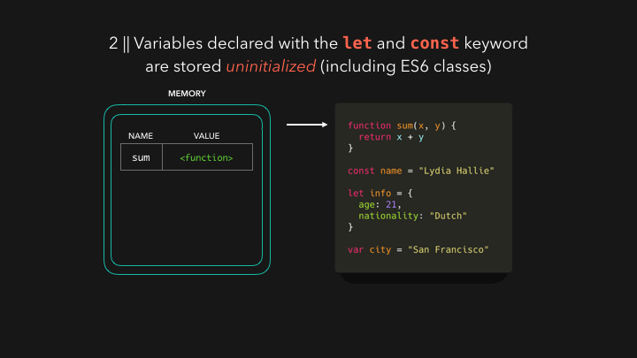
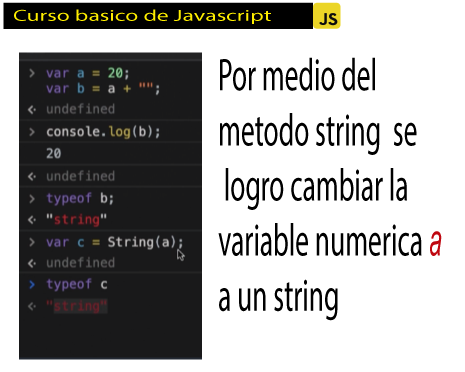

<!-- IMAGEN DE INICIO -->
<a name="inicio"></a>


<!-- CONTENIDO CURSO -->


# CONTENIDO DEL CURSO
## [Modulo 1 Introducción a JavaScript](#modulo1)

* [**Clase 1**](#clase1)   ¿Qué es JavaScript?
* [**Clase 2**](#clase2) ¿Por qué JavaScript?
* [**Clase 3**](#clase3) Elementos de un Lenguaje de Programación: Variables, Funciones y Sintaxis
* [**Clase 4**](#clase4) Variables en JavaScript 
* [**Clase 5**](#clase5) Funciones en JavaScript
* [**Clase 6**](#clase6) ¿Qué es una función declarativa y una expresiva?  
  

## [Modulo 2 Bases de JavaScript](#modulo2)

* [**Clase 7**](#clase7) Scope
* [**Clase 8**](#clase8) Hoisting
* [**Clase 9**](#clase9) Coerción
    1. Coerción implicita
    2. Coerción Explicita
   
* [**Clase 10**](#clase10) Valores: Truthy y Falsy
* [**Clase 11**](#clase11) Operadores: Asignación, Comparación y Aritméticos.

## [Modulo 3 Condicionales](#modulo3)

* [**Clase 12**](#clase12) Condicionales: If, Else, else if
* [**Clase 13**](#clase13) Switch
  

## [Modulo 4 Arrays](#modulo4)

* [**Clase 14**](#clase14) Arrays

  
## [Modulo 5 Loops](#modulo5)
 
* [**Clase 15**](#clase15) Loops: For y For...of
* [**Clase 16**](#clase16) Loops: While


## [Modulo 6 Objects](#modulo6)

 
* [**Clase 17**](#clase17) Objects
* [**Clase 18**](#clase18) Objects: Función constructora

 
## [Modulo 7 Métodos de Arrays](#modulo7)

* [**Clase 19**](#clase19) Métodos de recorridos de Arrays
* [**Clase 20**](#clase20) Recorriendo Arrays con .find(), .forEach() y .some()
* [**Clase 21**](#clase21) Eliminando elementos de un Array 


## [Modulo 8 Próximos pasos con JavaScript](#modulo8)
 
* [**Clase 22**](#clase22) Continúa con el Curso Práctico de JavaScript

* [**Metodos**](#metodos) aprendidos a lo largo del curso basico de JavaScript


# **<span style="color:red"> Modulo 1 Introducción a JavaScript </span>** 
<a name="modulo1"></a>
[**Volver al inicio**](#inicio)
<a name="clase1"></a>
## **<span style="color:yellow"> **Clase 1** ¿Qué es JavaScript? </span>** 

### **¿Cómo nace JavaScript?**

Nace con la necesidad de generar dinamismo en las páginas web y que a su vez los usuarios y las empresas pudieran interactuar unos con otros.

### **¿Qué es JavaScript?**

Es un lenguaje **<span style="color:red"> interpretado </span>**, orientado a objetos, débilmente tipado y dinámico.

**Débilmente tipado** 
Se pueden hacer operaciones entre tipos distintos de datos (enteros con strings, booleanos con enteros, etc.).

``` javascript
4 + "7"; // 47
4 * "7"; // 28
2 + true; // 3
false - 3; // -3
```
**Dinámico**
Corre directamente en la etapa de Runetime sin una etapa de compilación previa. Esto permite probar nuestro código inmediatamente; pero también es lo que hace que los errores se muestren hasta que se ejecuta el programa.

### **¿Realmente es JavaScript un lenguaje interpretado?**

Si, y la razón es que el navegador lee linea por linea nuestro código el cuál le indica lo que tiene que hacer, sin la necesidad de compilar. Todo esto es controlado por el motor de Javascript V8 del navegador

[**Volver al inicio**](#inicio)
<a name="clase2"></a>
## **<span style="color:yellow"> **Clase 2** ¿Por qué JavaScript? </span>** 

JavaScript tiene una comunidad enorme de desarrolladores que te pueden ir ayudando a generar diferentes cosas.

1. Si solo estuvieras interesado en trabajar aplicaciones web tienes muchos frameworks y librerías construidas en JavaScript que te van a ayudar a hacer proyectos de forma mucho mas rápida, eficiente y robusta (Angular, View, React,entre otros)

2. Si no quieres trabajar solo en aplicaciones Web puedes utilizar JavaScript con un framework que se llama React Native para poder construir aplicaciones nativas como Android y IOS.
3. Puedes construir aplicaciones de escritorio con JavaScript, usando un framework llamado Electron, pueden correr en Mac o Windows.
4. También puedes trabajar en la parte del Back-end o **IOT**(Internet Od Things) es un concepto que se refiere a una interconexion digital de objetos cotidianos con Internet. Esto con un Framework llamado NodeJS, el cual es un entorno de ejecución de JavaScript que corre directamente en el Back-end.


[**Volver al inicio**](#inicio)
<a name="clase3"></a>
## **Clase 3** Elementos de un Lenguaje de Programación: Variables, Funciones y Sintaxis

 Hay dos componentes principales:
 1. Data que guardamos en memoria
 2. Tareas(funciones) que haremos con esa data

Existen estos tipos de datos:

``` javascript
// Tipos primitivos

40 // numeros

// strings
"Diego de granda"

// booleanos
truefalse

//valores vacios
null
undefined

// tipos de objetos o no primitivos

[1,2,3] // corchetes // arrays
{ nombre: "Kevin"} // llaves / objetos

```

### ¿Como comprobar esta informacion? 

Estando en el navegador(en este caso google chrome) se ejecuta la accion inspeccionar y al ejecutar en la consola el comando **typeof** los tipos de datos se puede verificar el tipo de dato:


[**Volver al inicio**](#inicio)
<a name="clase4"></a>
## **Clase 4** Variables en JavaScript

### ¿Como podemos entender una variable?

Variable es un lugar en memoria. Es una representación de algún lugar en la memoria para guardar datos


### ¿Como es el ciclo para definir una variable?

primero se declara y luego se inicializa

```javascript
var nombre = "Kevin";

// declarar
var edad;

edad
// inicializar
edad = 30;

edad

var elementos = ["computadora", "celular"];

var persona = {
    nombre: "Kevin",
    edad: 30
}
```

### ¿Como declarar una variable?

Se puede declarando e inicializar en la misma linea de codigo
```javascript
var a = 0, b = 0;
```

### ¿Que tipo de variables hay?


Dentro de JavaScript tenemos tres formas de declarar una variable las cuales son: **var**, **const** y **let**.

**Var**: Era la forma en que se declaraban las variables hasta ECMAScript 5. Casi ya no se usa porque es de forma global y tiene las siguientes características:
**Se puede reinicializar**: osea todas las variables se inicializan, por ejemplo:Var pokemonType = ‘electric’ entonces reinicializar es:Var pokemonType = ‘grass’ osea la misma variable con diferentes datos el último dato predomina.

**Se puede reasignar**: Si a la variable ya inicializada le reasignamos otro valor por ejemplo: inicializamos la variable: Var pokemonType = ‘electric’ ahora la reasignamos pokemonType = ‘grass’ y el valor anterior se borra.


**Su alcance es función global:** Esto quiere decir que inicializamos la variable, pero la podemos llamar desde cualquier bloque (una llave abierta y una cerrada {}) pero hay que tener mucho cuidado con ello ya que puede haber peligro, no es recomendable usar VAR.

Const: sirve para declarar variables que nunca van a ser modificadas:
No se puede reinicilizar: es una const única no puede haber otra inicializada con el mismo nombre. const pokemonType = ‘electric’ no puede haber:const pokemonType = ‘grass’
No se pude re asignar: una vez que la hayamos inicializado no la podemos reasignar solo con su nombre: const pokemonType = ‘electric’ no puede ejecutarse:pokemonType = ‘grass’
No es inmutable: osea no puede cambiar con objetos:

Let: Es una variable que también podra cambiar su valor, pero solo vivirá(Funcionara) en el bloque donde fue declarada.

[**Volver al inicio**](#inicio)
<a name="clase5"></a>
## **Clase 5** Funciones en JavaScript

### Basicamente tenemos dos tipos de funciones

 1. **Funciones declarativas**


En las funciones declarativas, utilizamos la palabra reservada **function** al inicio para poder declarar la función:
```javascript
function saludar(nombre) {
	console.log(`Hola ${nombre}`);
}

saludar("Kevin");
```
  2. **Funciones expresivas**
  
En esta funcion la declaración se inicia con la palabra reservada **var**, donde se generará una variable que guardará una función anónima.

```javascript

var nombre = function(nombre){
    console.log(`Hola ${nombre}`)
}

nombre("Kevin");
```

### Diferencias:

A las funciones declarativas se les aplica hoisting, y a la expresión de función, no. Ya que el hoisting solo se aplica en las palabras reservadas **var** y **function**.


Lo que quiere decir que con las funciones declarativas, podemos mandar llamar la función antes de que ésta sea declarada, y con la expresión de función, no, tendríamos que declararla primero, y después mandarla llamar.

entonces en la funcion declarativa no va a haber problema si se llama la funcion antes o despues de declararla, como vemos a continuacion:


pero no sucede lo mismo en el caso de la funcion expresiva:


| funcion declarativa | funcion expresiva |
|---------------------|-------------------|
| Se declara con **function** |Se declara con **var** |
| **Si** se puede llamar la funcion antes de declararla | **No** se puede llamar la funcion antes de declararla|

[**Volver al inicio**](#inicio)
<a name="clase6"></a>
## **Clase 6** ¿Qué es una función declarativa y una expresiva?

Recordemos! La funcion declarativa se inicia con la palabra **function** y la expresiva con **var**

veamos un ejemplo

```javascript

// FunctionDeclaration
function foo(){
  // Some code goes here...
}
 
// FunctionExpression
var foo = function(){
  // Some code goes here...
}

```
veamos un ejemplo de que efectivamente en la funcion declarativa se puede llamar la funcion despues de declararla:


# Quiz!

Cual es la palabra clave que necesita una función para devolver una salida?

* **return**

Además de la sintaxis ¿cuál es la principal diferencia entre una función declarativa y una expresión de función?

*   Podemos llamar una función declarativa **antes** de ser declarada. 

En JavaScript es posible declarar e inicializar una variable en la misma línea:

* **verdadero**

Son los tipos de datos primitivos que maneja JavaScript:

* String, Number, Boolean, Null y Undefined

¿En qué tipo de proyectos podemos utilizar JavaScript?

* Frontend, backend, aplicaciones móviles, aplicaciones de escritorio y IoT.

¿Por qué nace JavaScript?

* Para darle interacción y dinamismo a los sitios web.


<a name="modulo2"></a>

#  **Modulo 2 Modulo Bases de JavaScript** 


[**Volver al inicio**](#inicio)
<a name="clase7"></a>
## **Clase 7** Scope

El scope de una variable hace referencia al lugar donde esta va a vivir , o podrá ser accesible.Podríamos decir también que scope es el alcance que determina la accesibilidad de las variables en cada parte de nuestro código. 

¿Y para qué nos sirve el Scope?

* Entender bien el concepto de scope **ayuda a aumentar el nivel de seguridad** ya que delimita quienes tienen acceso y quienes no a determinadas partes de nuestro código, **también nos facilitará en la detección y disminución de errores**, por ende nuestro código será más robusto. 

Pensemos en el siguiente ejemplo para entenderlo mejor, una persona no puede acceder al espacio de una hormiga, esto implica que no les puede quitar facilmente la comida, ni puede sentarse a comer con ellas o a compartir y trabajar con ellas facilmente en grupo, sin embargo, desde la perspectiva de las hormigas es mas facil acceder al ser humano como tal, porque lo ve muy facil desde abajo.


### Asi mismo en el scope local se puede llamar a las funciones globales pero desde el scope global no se puede llamar a una funcion local.

Todo lo que esta en global, no puede acceder a lo local


### veamos que dentro de una funcion local se puede acceder a una variable global:


### Pero por el contrario, no se puede acceder a una variable local desde una funcion global:


### Y efectivamente aparece miApellido is not defined

[**Volver al inicio**](#inicio)
<a name="clase8"></a>
## **Clase 8** Hoisting
---

### ¿Qué es Hoisting?

#### Hosting, o elevación ***es el comportamiento por defecto de JavaScript de “mover declaraciones al principio” del código***.

#### JavaScript es confuso por muchas razones. Hablando de hoisting, es importante saber que en este lenguaje, una variable puede ser declarada después de ser usada. Sí, ¡esto significa que se puede usar una variable antes de declararla
 
entendamoslo con los siguientes gifs:





[link de esta informacion - hoisting](https://dev.to/lydiahallie/javascript-visualized-hoisting-478h)

Muy bien, entonces, en resumen...Las funciones y variables se almacenan en la memoria para un contexto de ejecución **antes** de que ejecutemos nuestro código. Esto se llama hoisting.

## y que pasa si se llama una funcion declarativa antes de declararla?, 

pues veamos:


Queda como **undefined** debido a que al momento de ejecucion del programa esta funcion fue asignada como **undefined** en un espacio de memoria

#### se procesan las funciones y las variables antes de ejecutar un codigo?

* si, pero las funciones se declaran antes que las variables

#### y entonces que debo hacer a la parte practica?

* lo mejor seria por buenas practicas declarar las funciones en las primeras lineas de codigo y luego las variables para evitar problemas de hoisting. 

[**Volver al inicio**](#inicio)
<a name="clase9"></a>
## **Clase 9** Coerción

Coerción es la forma en la que podemos cambiar un tipo de valor a otro, existen dos tipos de coerción:
* Coerción implícita = es cuando el lenguaje nos ayuda a cambiar el tipo de valor.
* Coerción explicita = es cuando obligamos a que cambie el tipo de valor.


estos dos ejemplos son una demostracion de coercion implicita, porque es javascipt el que se encarga de hacer la coercion, 
pero vamos a ver la coercion explicita:

## coercion explicita

en esta coercion uno se puede valer de metodos para hacer cambiar un tipo de variable a otra, por ejemplo:

* con el metodo **string()** puedo asegurarme que la variable de salida sera un string, este metodo hace una coercion explicita



vamos a ver un ejemplo de como cambiar una variable string a numerica:


```javascript
  //Ejemplos de Coerción:

var a = 4 + "7"; //Convierte a 4 en un string y lo concatena con el "7", por esto regresa un string de valor "47"

4 * "7"; //Convierte al "7" en un número y realiza la operación, por esto devuelve 28

var a = 20;
var b = a + ""; //Aquí concatenamos para convertir la variable a string (coerción implícita)
console.log(b); 

var c = String(a); //Aquí obligamos a la variable a convertirse en string (coerción explícita)
console.log(c);

var d = Number(c); //Aquí obligamos a la variable a convertirse en número (coerción explícita)
console.log(d);
```
[**Volver al inicio**](#inicio)
<a name="clase10"></a>
## **Clase10** Valores: Truthy y Falsy 

Truthy y Falsy basicamente consiste en saber que valores por defecto son **falsos** o **verdaderos** en javascript,y esto es importante para hacer ciertos ciclos condicionales mas adelante, veamos ejemplos:

```javascript
//Ejemplos en los que Boolean devuelve Falso:
Boolean(0); //false
Boolean(null); //false
Boolean(NaN); //false
Boolean(undefined); //false
Boolean(false); //false
Boolean(""); //false

//Ejemplos en los que Boolean devuelve verdadero:
Boolean(1); //true para 1 o cualquier número diferente de cero (0)
Boolean("a"); //true para cualquier caracter o espacio en blanco en el string
Boolean([]); //true aunque el array esté vacío
Boolean({}); //true aunque el objeto esté vacío
Boolean(function(){}); //Cualquier función es verdadera también

```

[cheatset de js](https://javascript.pythoncheatsheet.org/#export)


<a name="clase11"></a>
## **Clase11** Operadores: Asignación, Comparación y Aritméticos.

| operadores | en | Javascript| 
|-----|--------|-----|
|Asignación| Comparación|Aritméticos|
| var a = 1 | == , === , < , <= , > , >= | + , - , * , / |
 
```javascript
  // comparación 

3 == '3' // es igual

3 === '3' // es estrictamente igual 

5 < 3, 5 <= 3, 5 > 3, 5 >= 3 // menor, menor o igual, mayo, mayor o igual 

a && b // operador and (y), este operador genera una valicación siempe y cuando ambas variables sean verdad, "var 1 y var 2"

true || false // operador or (o), este operador genera una validacion siempre y cuando cuaquier de as variables sea verdad, "var 1 o var 2"
```

[Expressions and operators](https://developer.mozilla.org/en-US/docs/Web/JavaScript/Guide/Expressions_and_Operators)


# Quiz del modulo

## 1. ¿Qué diferencia hay entre comparar con "'==" y "==="?
   
* "==" compara valores. "===" compara valores y tipo de dato.

## 2. ¿Cuál es la naturaleza de los valores booleanos?

* true y false.

## 3. ¿En qué consiste la coerción explícita?

* En obligar cambiar el tipo de una variable a otra.

## 4. ¿Qué valor se asigna por defecto a las variables cuando caen en hoisting?

* undefined.

## 5. En el scope local de una función puedo usar variables:
   
* Variables del scope global y locales de esa función.

<a name="modulo3"></a>

#  **Modulo 3 Condicionales**  


[**Volver al inicio**](#inicio)
<a name="clase12"></a>
## **Clase12**  Condicionales: If, Else, else if

```javascript 

if () {    // estructura del if

} else{

}
```

### Funcionamiento

```javascript 
var edad = 17;

if (edad >= 18) {     // si la edad es mayor o igual de 18 puede conducir 
    console.log("puedes conducir")
} else{
    console.log("no puedes conducir")
}

```

### Como puedo hacer una validacion if y else en una sola linea de codigo?

```javascript
  condition ? true : false;

ejemplo

var numero = 1

var resultado = numero === 1 ? "Si soy 1" : "No soy 1"
```


### pregunta tricky , aunque el siguiente codigo corre bien, por que no funciona para la logica de jugar piedra, papel o tijeras?

```javascript
  var jugador = "tijera";
var maquina = "papel";

if (jugador == "piedra" && maquina == "tijeras"){
    console.log ("ganaste")
} else if (jugador == "piedra" || maquina =="papel" ){
    console.log("perdiste")
} else if (jugador == "tijera" && maquina == "papel"){
    console.log("ganaste")
}
else{
    console.log("perdiste")
}
```
rta = porque como no esta debidamente indentado se va a ejecutar en un orden diferente al esperado

### solucion:

```javascript

var jugador = "piedra";
var maquina = "papel";

if (jugador == "piedra" && maquina == "tijeras"){
    console.log ("ganaste")
    } else if (jugador == "tijera" && maquina == "papel"){
    console.log("ganaste")
    } else if (jugador == "piedra" || maquina =="papel" ){
    console.log("perdiste")
    } else{ console.log("perdiste")
    }

```

solucion al ejercicio de piedra, papel o tijera

```javascript
var jugador = "papel";
var maquina = "tijeras";

if (jugador == "tijeras"  && maquina == "papel"){
    console.log("Ganaste");
    }
    else if (jugador == "Piedra"  && maquina == "tijeras") 
    {
    console.log("Ganaste");
    }
    else if (jugador == "papel"  && maquina == "piedra") 
    {
    console.log("Ganaste");
    }
    else if (jugador == maquina ) 
    {
    console.log("empate");
    }
else {
    console.log("Perdiste")
}
```
[**Volver al inicio**](#inicio)
<a name="clase13"></a>
## **Clase13** Switch

```javascript
Syntaxis
switch (expresión) {
  case valor1:
    //Declaraciones ejecutadas cuando el resultado de expresión coincide con el valor1
    [break;]
  case valor2:
    //Declaraciones ejecutadas cuando el resultado de expresión coincide con el valor2
    [break;]
  ...
  case valorN:
    //Declaraciones ejecutadas cuando el resultado de expresión coincide con valorN
    [break;]
  default:
    //Declaraciones ejecutadas cuando ninguno de los valores coincide con el valor de la expresión
    [break;]
}
```
tomado de [https://developer.mozilla.org/es/docs/Web/JavaScript/Reference/Statements/switch](sw)

veamos un ejemplo sencillo

```javascript
expr = 'Papayas'

switch (expr) {
    case 'Naranjas':
      console.log('El kilogramo de naranjas cuesta $0.59.');
      break;
    case 'Manzanas':
      console.log('El kilogramo de manzanas cuesta $0.32.');
      break;
    case 'Platanos':
      console.log('El kilogramo de platanos cuesta $0.48.');
      break;
    case 'Cerezas':
      console.log('El kilogramo de cerezas cuesta $3.00.');
      break;
    case 'Mangos':
    case 'Papayas':
      console.log('El kilogramo de mangos y papayas cuesta $2.79.');
      break;
    default:
      console.log('Lo lamentamos, por el momento no disponemos de ' + expr + '.');
  }
  
  console.log("¿Hay algo más que te quisiera consultar?");
```

## Quiz modulo 3

### 1. ¿Qué pasa si no coloco la sentencia `break` en un `switch`?
* Se validan todos los casos como verdaderos y se realizan las acciones asignadas a cada uno.

### 2. ¿Qué retorna el siguiente código? if (false === !true) { console.log(false == true) } else { console.log(true === !false) }

* false
  
### 3.¿En qué casos es conveniente utilizar `switch`?

* Cuando tenemos múltiples casos a evaluar y evitar el uso de múltiples “if else”.

### 4. ¿Para qué nos sirve el operador ternario "?" ?

* Para definir una condición, el resultado cuando se cumple y cuando no se cumple, en una sola línea.


<a name="modulo4"></a>

#  **Modulo 4 Arrays** 

<a name="metodos"></a>

## **Metodos** 


### typeof

* El operador typeof devuelve una cadena que indica el tipo del operando sin evaluarlo. operando es la cadena, variable, palabra clave u objeto para el que se devolverá su tipo. Los paréntesis son opcionales. 
[https://developer.mozilla.org/es/docs/Web/JavaScript/Reference/Operators/typeof](typeof)

```javascript
var forma = "redonda"
typeof forma === 'string'

```
### console.log

* Muestra un mensaje en la consola web (o del intérprete JavaScript). 
[https://developer.mozilla.org/es/docs/Web/API/Console/log](console.log)

```javascript
 console.log("hello world)

```


### string()

* para forzar un dato a convertirse en string 
[https://developer.mozilla.org/es/docs/Web/JavaScript/Reference/Global_Objects/String](string)

```javascript
let s1 = '2 + 2'              // crea una string primitiva
let s2 = new String('2 + 2')  // crea un objeto String
console.log(eval(s1))         // devuelve el número 4
console.log(eval(s2))         // devuelve la cadena "2 + 2"

```


### number()

* para forzar un dato a convertirse en un tipo, is a primitive wrapper object used to represent and manipulate numbers like 37 or -9.25.
[https://www.w3schools.com/js/js_number_methods.asp]()

```javascript
Number('123')  // returns the number 123
Number('123') === 123  // true

```


### alert

* su finalidad es la de mostrar por pantalla mensajes de alerta encuadrados en una pequeña ventana modal. 
[https://www.anerbarrena.com/javascript-alert-confirm-prompt-js-5497/]()

```javascript
	
alert("Mi primer alert");

```

### Boolean

* para validar si un numero es false or true 
[]()

```javascript

Boolean(0); //false
Boolean(null); //false
Boolean(NaN); //false
Boolean(undefined); //false
Boolean(false); //false
Boolean(""); //false

//Ejemplos en los que Boolean devuelve verdadero:
Boolean(1); //true para 1 o cualquier número diferente de cero (0)
Boolean("a"); //true para cualquier caracter o espacio en blanco en el string
Boolean([]); //true aunque el array esté vacío
Boolean({}); //true aunque el objeto esté vacío
Boolean(function(){}); //Cualquier función es verdadera también
```

## METODOS APRENDIDOS EN EL JUEGO DE PIEDRA PAPEL O TIJERA

### onclick

* The onclick event occurs when the user clicks on an element
[https://www.w3schools.com/jsref/event_onclick.asp](onclick)

```javascript
            btn_iniciar.onclick = function() {
                Menu = "inicio";
                Opcion_cpu = num_aleatorio()
                display_opcion_cpu(Opcion_cpu);
                game(Opcion_jugador, Opcion_cpu);
            }

```

### style.backgroundImage

* le pone imagen a un boton 
[https://www.w3schools.com/jsref/prop_style_backgroundimage.asp](style.backgroundImage)

```javascript
document.body.style.backgroundImage = "url('img_tree.png')";

btn_piedra.style.backgroundImage = " url('./assets/images/piedra.png')";


```

### document.getElementById

* Devuelve una referencia al elemento por su ID.

 
[https://developer.mozilla.org/es/docs/Web/API/Document/getElementById](document.getElementById)

HTML
```html
<html>
<head>
   <title>Ejemplo getElementById</title>
</head>
<body>
   <p id="para">Cualquier texto acá</p>
   <button onclick="changeColor('blue');">Azul</button>
   <button onclick="changeColor('red');">Rojo</button>
</body>
</html>
```

javascript
```javascript
function changeColor(newColor) {
   var elem = document.getElementById('para');
   elem.style.color = newColor;
}
```
Resultado
* crea una ventana con dos botones, un boton cambia el color del texto a rojo y otro a azul

### nombremetodo

* descripcion 
[]()

```javascript


```

### nombremetodo

* descripcion 
[]()

```javascript


```
